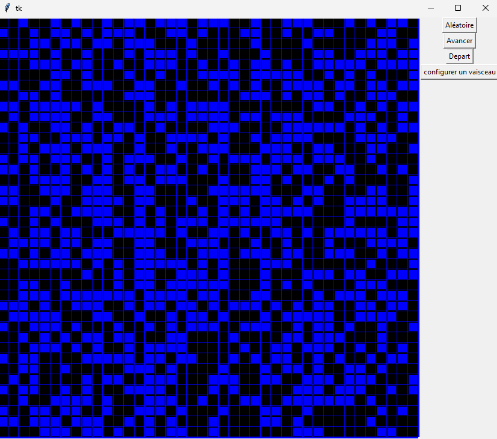

# Jeux de la vie
Le Jeu de la vie est un « jeu à zéro joueur », puisqu'il ne nécessite aucune intervention du joueur lors de son déroulement. Il s’agit d’un automate cellulaire, un modèle où chaque configuration conduit mécaniquement à la configuration suivante à partir de règles préétablies, une cellule naît si elle est entourée de trois cellules vivantes, et elle reste en vie si elle est entourée par deux cellules vivantes sinon elle meurt. Tout cela est simplement représenté sur un quadrillage avec des cellules de couleurs différentes, habituellement le noir pour les cellules vivantes et le blanc pour les cellules mortes.


Le jeux se lance en exécutant la commande:
```shell
python3 jeu_vie/affichage.py
```

## Fichiers sources

Le projet a été testé avec la version 3.11 de python mais semble fonctionner également avec EduPython.
* [jeu_vie/affichage.py](jeu_vie/affichage.py): le code de gestion de l'affichage
* [jeu_vie/moteur.py](jeu_vie/moteur.py): le code du moteur du jeu de la vie
* [tests/moteur_test.py](tests/moteur_test.py): les tests du moteur

Le projet utilise les outils de [typage python](https://docs.python.org/fr/3.10/library/typing.html). Les types sont vérifiés grâce à l'outil [mypy](https://koor.fr/Python/Tutorial/python_fonction_controle_typage.wp).

## Utilisation de tkinter

Le projet utilise la bibliothèqque [tkinter](https://math.univ-lyon1.fr/irem/Formation_ISN/formation_interfaces_graphiques/module_tkinter/interfaces.html#:~:text=tkinter%20est%20un%20module%20de,en%20raison%20de%20sa%20simplicit%C3%A9.).

Pour éviter d'utiliser des variables globales (qui sont déconseillées car elles ont tendances à créer des [effets de bord](https://fr.wikipedia.org/wiki/Effet_de_bord_(informatique))) on utilise des fonctions imbriquées.
Le problème est que tkinter nécessite des fonctions sans arguments et pour éviter d'utiliser des variables globales on utilise cette technique:

```python
def clique_affiche_rectangle(canevas: Canvas) -> callable:
    def affiche_rectange():
        canevas.create_rectangle(1, 1, 4, 4, fill="white")
    # retourne la fonction sans argument qui sera appelée par tkinter
    # mais connait la variable canevas sans qu'elle soit globale.
    return affiche_rectange


can1 = Canvas(fenetre, bg="white", height=taille, width=taille)
# la variable can1 n'a pas besoin d'être globale
bouton = Button(fenetre, text="rectangle", command=clique_affiche_rectangle(can1))
```

Dans le projet nous utilisons une classe `Affichage` contenant toutes les variables necessaire à la gestion de l'affichage et de la matrice du jeu de la vie. Cette classe utilise [dataclass](https://docs.python.org/fr/3.10/library/dataclasses.html) qui cré automatiquement son constructeur.


## Tests

Le projet utilise [tox](https://zestedesavoir.readthedocs.io/fr/latest/utils/tox.html) qui automatise l'exécution des tests.

Installer tox:
```python -m install tox```

Lancer les tests:
```shell
python -m tox
```

Les vérifications effectuées sont:
* le style avec [flake8](https://zestedesavoir.com/tutoriels/2514/un-zeste-de-python/10-annexes/5-outils/). Cela vérifie que le style est conforme aux règles [PEP8](https://python.doctor/page-pep-8-bonnes-pratiques-coder-python-apprendre)
* les types avec [mypy](https://koor.fr/Python/Tutorial/python_fonction_controle_typage.wp)
* les tests de code avec [pytest](https://he-arc.github.io/livre-python/pytest/index.html)